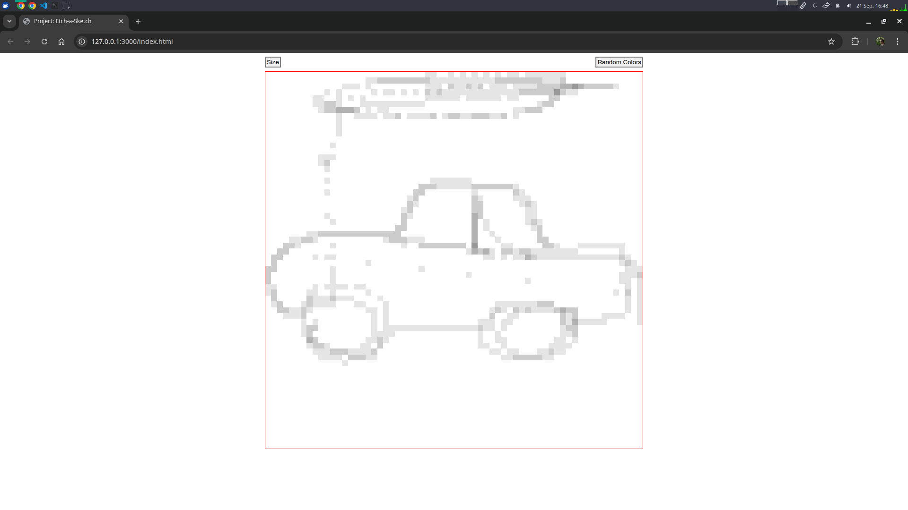

# Project-Etch-a-Sketch
A browser-based sketchpad inspired by the classic Etch-a-Sketch toy.

This project was built as part of [The Odin Project](https://www.theodinproject.com/) curriculum to practice DOM manipulation with JavaScript.

## Features
- Adjustable grid size (up to 100x100)
- Two drawing modes: grayscale and random colors
- Progressive darkening effect (each pass darkens a square by 10%)
- Responsive layout using CSS Flexbox
- Clean and minimal UI

## Technologies Used
- HTML5
- CSS3 (Flexbox)
- JavaScript (ES6+)

## About
This project was created to strengthen my understanding of DOM manipulation, event handling, and dynamic styling in JavaScript. I wanted to recreate a nostalgic toy in a modern, interactive way.

## How to use
1. [Try it live!](https://bgns42.github.io/Project-Etch-a-Sketch/) or clone/download this repository.
2. Open `index.html` in your browser.
3. Click the **Size** button to set the grid size.
4. Hover over the grid to draw.
5. Click **Random Colors** to switch to color mode.

## Screenshots

## What I Learned
- DOM manipulation and event handling in JavaScript
- Dynamic creation and styling of HTML elements
- Using Flexbox for responsive layouts
- Implementing interactive UI features

## Challenges & Solutions
- **Dynamic Grid Sizing:**  
  Ensuring the grid remained responsive and visually consistent at all sizes required careful calculation of square dimensions and use of Flexbox.
- **Progressive Darkening:**  
  Implementing a smooth darkening effect with each mouseover involved tracking and updating the opacity of each square individually.
- **User Experience:**  
  I focused on keeping the interface intuitive and minimal, while providing immediate feedback for user actions.
  
## Possible Improvements
- Add an eraser mode
- Allow users to save their drawings
- Add touch support for mobile devices

## Author
Made by [BGNS42](https://github.com/bgns42)  
Feel free to connect with me on [LinkedIn](https://www.linkedin.com/in/igor-carrasco) or check out my other projects!

## License

This project is open source and available under the [MIT License](LICENSE).

---